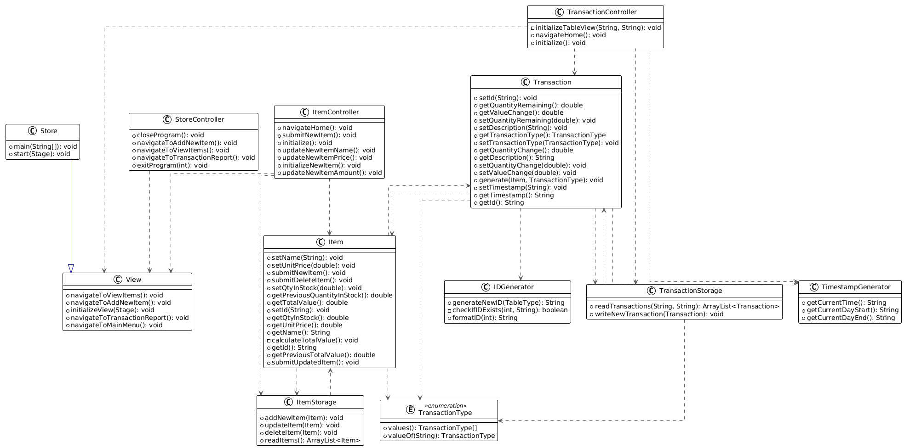

# Intro to Programming Assignment - PART TWO

# Overview:
- This is a Java based program to manage inventory, it includes the capability to add items, update their quantity and delete them, for each action a transaction is generated, recording the action permanently.
- The code in this branch is for Part One of the assignment, it comprises a CLI user interface and a text file
  based storage system acting as a basic "database".
- The project uses [Gradle](https://gradle.org/) as it's dependency manager and build tool.
- Some common commands for this project are:
- ```./gradle clean build``` - This cleans out the existing builds and builds the project into a .jar file.
- ```./gradle test``` - Runs the JUnit tests for the project (These are also run during builds).

# Getting Started (IntelliJ):

- To download the repository files, Clone the repository from GitHub [here](https://github.com/0xKona/I2PAssignmentv2)
- If you don't know how to clone the files from GitHub, follow [this](https://docs.github.com/en/repositories/creating-and-managing-repositories/cloning-a-repository) guide.
- You'll need to use `git checkout part-2` to go to the PART TWO branch however the main branch will show the most up-to-date version as well, run this in a terminal at the root of the project. [You will need GIT installed for this to work](https://git-scm.com/book/en/v2/Getting-Started-Installing-Git)
- If you have the files already (I.E When I submit this as a ZIP file etc.) you can skip the above steps
- Open the project in IntelliJ using `file -> open -> navigate the folder location`
- Ensure project is saved inside a folder named `InventoryManagementSystem` if it is not already, failure to do so has been known to cause issues in development mode


# Getting Started (Eclipse):

- This project was written using IntelliJ however attempts to open the project and run it in eclipse were successful.
- Follow first two steps in the IntelliJ guide if needed.
- In eclipse go to `file -> open project from file system`  and set import source to project location and again ensure project is saved inside a folder named `InventoryManagementSystem` if it is not already, failure to do so has been known to cause issues in development mode
- You may notice that eclipse generate some files when it opens the project, this is fine and is normal.


## Creating an un-packaged build and Running it

- Run `./gradlew jlink`
- This will create a build in `build/image` to run it, run the following command form the root of the project:
- `./build/image/bin/InventoryManagementSystem` or you can simply double-click on it.

## Running the example build

- Included is an executable build of the GUI application
- 1.) Double Click! Open the `exampleBuild` and double-click on the InventoryManagementSystem.app (for macOS).

## Running an executable .jar file

-By default, this project uses gradle to download and handle dependencies which means the JDK that specifically runs JavaFX is not installed on my machine meaning whilst a .jar file is successfully built using `./gradlew build` I cannot run it as the JavaFX Runtime is not bundled inside this Jar which is why the above build processes are used instead, theoretically however you should be able to run a .jar file generated with the following steps provided you have the JavaFX runtime locally installed on your machine.
- 1.) At the root of the project in a terminal run `.gradlew build` to build the project.
- 2.) The .jar file will be located in `build/libs`
- 3.) To run it execute the following command in your terminal at the root of the project `java -jar build/libs/InventoryManagementSystem-2.0.0.jar`


## Documentation:
- Each class and public method has a Java Doc comment explaining its function and any arguments required and return values.
- If using IntelliJ (And most modern IDE's) this enables you to hover over a usage, and it will quickly give more information about the class / method.

## Testing:
- Tests a written using [JUnit](https://junit.org/junit5/) and [Mockito](https://site.mockito.org/) for mocking.
- Tests are run during the build process, the build process will not complete unless all tests pass ensuring that 'degredation' does not occur adn that any new changes or features do not break the functionality of the application, however in circumstances the tests may need to be updated if the codebase changes drastically.
- You can run the tests by opening a terminal at the root of the project and running:
- ```./gradlew test```
- After running a test the project uses [Jacoco](https://github.com/jacoco/jacoco) To generate a code coverage report which tells you how much of your code is tested.
- You can open this report by navigating to `build/jacocoHtml` and opening the `index.html` file in your browser (You can usually just right click -> open in browser)

## UML Design:

To create the UML Designs i've used IntelliJ's built-in diagram tool and [PlantUML](https://www.plantuml.com/plantuml/uml/SyfFKj2rKt3CoKnELR1Io4ZDoSa700003)

